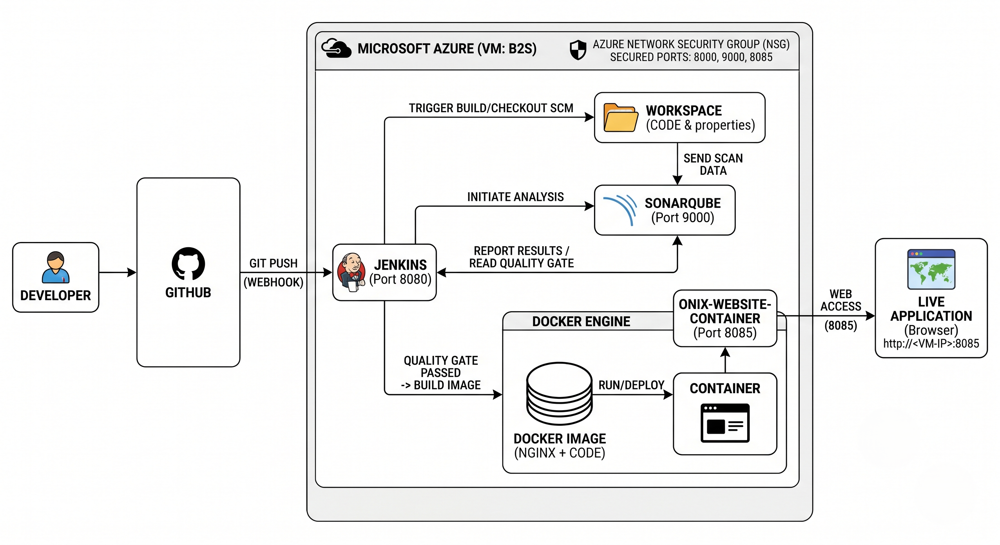
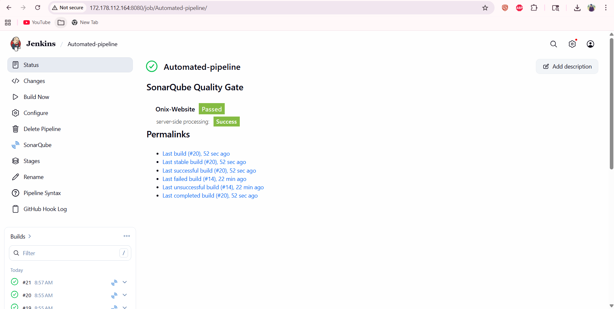
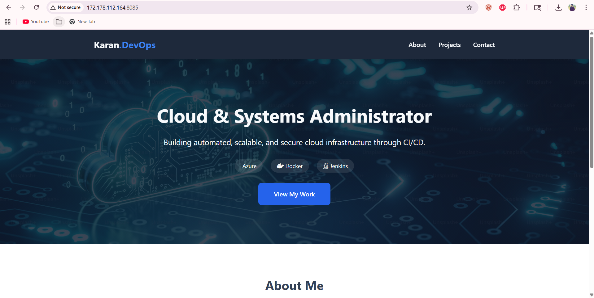

# 🚀 End-to-End Automated CI/CD Pipeline

A professional DevOps project demonstrating a fully automated workflow from code push to live deployment. This project showcases the integration of Azure cloud infrastructure, automated quality checks, and containerized delivery.

## 🏗️ Project Architecture

The pipeline is designed to ensure that **only high-quality, tested code** reaches the server:

1. **Source Control:** Code is managed and versioned in **GitHub**.
2. **Continuous Integration:** **Jenkins** (hosted on an Azure B2s VM) automatically detects changes and triggers the build.
3. **Automated Code Review:** **SonarQube** performs a deep scan for bugs and security risks before any code is built.
4. **Gatekeeper:** A "Quality Gate" acts as a safety switch—if the code fails quality standards, the pipeline stops to prevent a broken deployment.
5. **Containerization:** **Docker** packages the application into a lightweight, portable image.
6. **Instant Deployment:** The updated application is launched automatically as a Docker container on **Port 8085**.

## 🛠️ Tech Stack
* **Cloud Provider:** Microsoft Azure (Virtual Machines)
* **CI/CD Tool:** Jenkins (Pipeline-as-Code)
* **Quality Assurance:** SonarQube (Static Analysis)
* **Containerization:** Docker
* **Web Server:** Nginx (Alpine-based)
* **Certification Focus:** Infrastructure management based on **AZ-104 (Azure Administrator)** standards.

## 🚀 Key Features & Troubleshooting
* **Azure Infrastructure Management:** Configured Virtual Machines and Network Security Groups (NSGs) for secure communication across ports 8080, 9000, and 8085.
* **Proactive Quality Control:** Integrated SonarQube to catch security hotspots and bugs before they reach production.
* **Resource Optimization & Scaling:** Managed resource constraints on Azure by vertically scaling infrastructure from B1ms to B2s instances, ensuring sufficient compute power and memory for 100% pipeline stability during heavy SonarQube scans.
* **Automated Cleanup:** The pipeline automatically handles Docker image versioning and container cleanup to prevent resource conflicts.

## 📸 Project Snapshots

### 1. Automated Pipeline (Jenkins)

*Successfully passing the SonarQube Quality Gate.*

### 2. Live Application

*The final application running live in a Docker container.*

## 📖 Setup Summary
1. Jenkins is configured with a Webhook to track GitHub pushes.
2. The `Jenkinsfile` defines the automation stages (Checkout, Scan, Build, Deploy).
3. The `sonar-project.properties` manages the scan metadata and server connection.
4. The application is served via Nginx inside a Docker container for high performance.

---
**Author: Karanbir Singh** *Certified Azure Administrator | Aspiring Cloud & DevOps Engineer*
