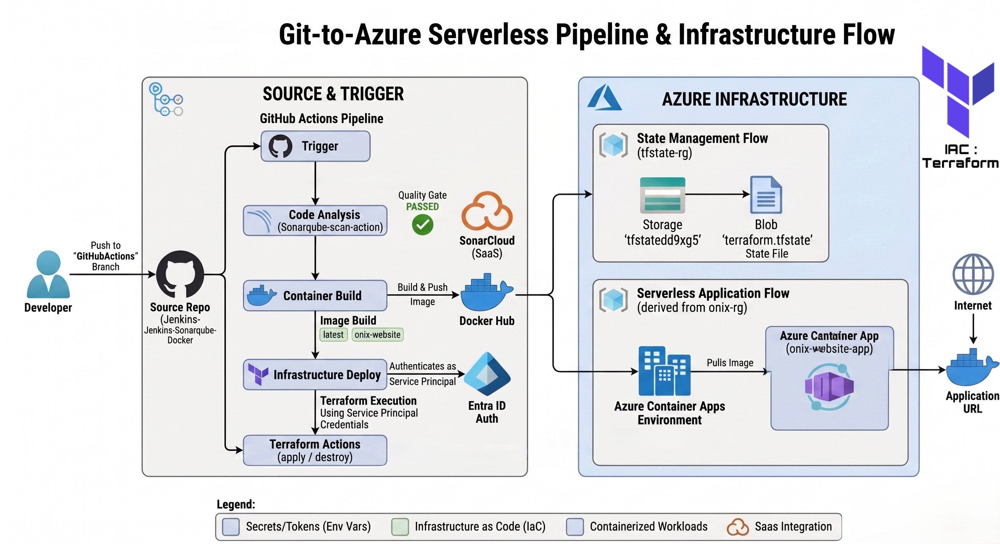

# 🚀 Modernized Git-to-Azure Serverless Pipeline

## **Overview**
This project demonstrates a complete migration from a legacy Jenkins-based environment to a fully automated **CI/CD** and **Infrastructure as Code (IaC)** pipeline. It automates the deployment of a containerized static website to **Azure Container Apps** while integrating security and quality gates at every step.

The architecture follows a "Code-to-Cloud" philosophy, ensuring that every push to the `GitHubActions` branch triggers a secure, reproducible, and scalable deployment.

---

## **🏗️ Architecture**


The pipeline is divided into three main logical phases:
*   **Source & Security**: Code resides in GitHub; pushes trigger a **SonarCloud** scan to ensure code quality and security compliance.
*   **Containerization**: The application is packaged into a **Docker** image and pushed to a registry (Docker Hub).
*   **Automated Infrastructure**: **Terraform** manages the Azure lifecycle, deploying the serverless environment and container instances.

---

## **🛠️ Tech Stack**
*   **Orchestration**: GitHub Actions
*   **Static Analysis**: SonarCloud (Quality Gate: Passed)
*   **Containerization**: Docker
*   **Infrastructure as Code**: Terraform
*   **Cloud Provider**: Microsoft Azure
*   **Hosting**: Azure Container Apps (Serverless)
*   **State Management**: Azure Blob Storage

---

## **🔧 Configuration & Secrets**
To run this pipeline, the following secrets must be configured in GitHub:

### **Azure Credentials**
*   `ARM_CLIENT_ID`
*   `ARM_CLIENT_SECRET`
*   `ARM_SUBSCRIPTION_ID`
*   `ARM_TENANT_ID`

### **Docker Hub**
*   `DOCKER_TOKEN`
*   `DOCKER_USERNAME`

### **SonarCloud**
*   `SONAR_TOKEN`

---

## **🚀 Pipeline Workflow**

### **1. Continuous Integration (CI)**
*   **Trigger**: Manual dispatch or push to the `GitHubActions` branch.
*   **Code Analysis**: Runs `sonarqube-scan-action` to verify the codebase against the quality gate.
*   **Build & Push**: Builds a Docker image labeled with the unique `run_number` and pushes it to Docker Hub.

### **2. Continuous Deployment (CD)**
*   **IaC Execution**: Terraform initializes with a remote backend stored in Azure Storage.
*   **Deployment**: Terraform applies the configuration to manage the website-app within the **Azure Container Apps Environment**.
*   **Cleanup**: A manual `destroy` action is integrated into the workflow for cost-effective environment management.

---

## **📁 Project Structure**
```text
├── .github/workflows/
│   └── ci-cd.yml          # GitHub Actions Pipeline definition
├── terraform/
│   ├── main.tf            # Azure Provider and Resource definitions
│   ├── variables.tf       # Infrastructure variables
│   └── backend.tf         # Azure Storage backend for .tfstate
├── screenshots/
│   └── architecture.png   # Architecture Diagram
├── website/
│   ├── index.html         # Application Source
│   └── Dockerfile         # Container manifest
└── README.md

---
**Author:** **Karanbir Singh**
*Certified Azure Administrator (AZ-104) | Specializing in DevOps, Cloud Engineering, and Automated Infrastructure.*
